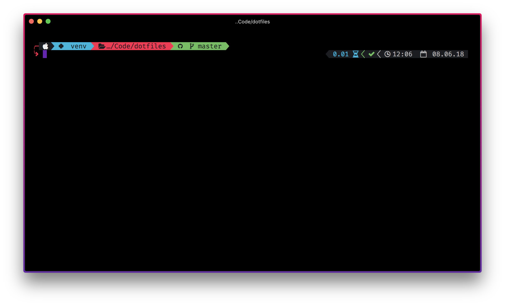

# dotfiles


The dotfile repo



## Getting started

### Install

* [Hyper](https://hyper.is/) Terminal, You can use your preferred terminal application
* zsh(z shell), alternative to bash shell
  * For *Debian/Ubuntu*-based systems
    ```shell
    sudo apt-get update
    sudo apt-get upgrade
    sudo apt-get install zsh
    ```
  * For *Red Hat*-based systems
    ```shell
    sudo yum upgrade
    sudo yum install zsh
    ```
  * For *SUSE*-based systems
    ```shell
    sudo zypper upgrade
    sudo zypper install zsh
    ```
  * For *macOS*
    * Step 1 – Install [*Homebrew*](http://brew.sh/)
      ```shell
      ruby -e "$(curl -fsSL https://raw.zshhubusercontent.com/Homebrew/install/master/install)"
      brew doctor
      ```

    * Step 2 – Install *zsh*
      ```shell
      brew install zsh
      ```
    * *Optional* step 3 – default shell
      ```shell
      sudo -s 'echo /usr/local/bin/zsh >> /etc/shells' && chsh -s /usr/local/bin/zsh
      ```
   * For *Windows*
      ¯\_(ツ)_/¯
* [oh-my-zsh](https://github.com/robbyrussell/oh-my-zsh)
* [powerline](https://github.com/powerline/powerline)
* Patched powerline fonts to show glyphs, I use pached version of Fira Code font [FuraCode](https://github.com/ryanoasis/nerd-fonts/tree/master/patched-fonts/FiraCode) from nerd-fonts
  * [nerd-fonts](https://github.com/ryanoasis/nerd-fonts)
  * [Powerline](https://github.com/powerline/fonts) Fonts
* [Powerline9k](https://github.com/bhilburn/powerlevel9k) theme for oh-my-zsh

### Setup your terminal to use patched fonts

e.g.

For hyper just add this line in *.hyper.js* config file. You can use additional font with FiraCode too

  ```javascript
  fontFamily: "FuraCode Nerd Font",
  ```
